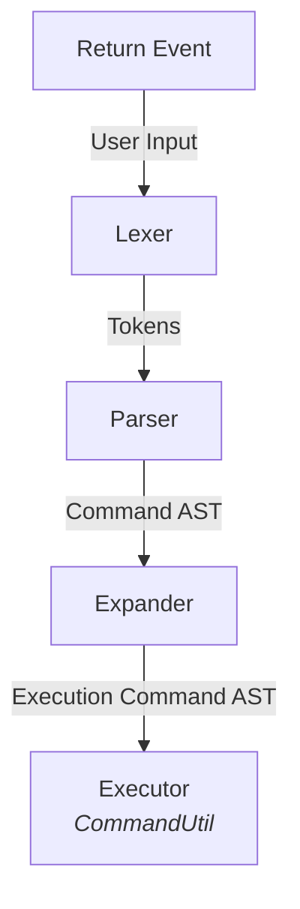

# Shell

High-level architecture for the site's shell.

# Process Flow



# Components

## Enter Event

The [Keydown Event](https://developer.mozilla.org/en-US/docs/Web/API/Element/keydown_event) for
the [Enter](https://developer.mozilla.org/en-US/docs/Web/API/UI_Events/Keyboard_event_key_values) key retrieves the user
input from the terminal and passes it to the `Lexer` through `CommandUtil`.

Any forms of escape sequence characters from the user (e.g. `\n`) will have both the `\` and following characters
preserved.

## Lexer

Responsible for consuming the user input and converting it into a stream of tokens. Tokens are structured with a type (
e.g. `WORD`, `EOF`) and a list of `parts`. These `parts` are subsections of a single token. For example take the below
input-

```
foo"and bar"with'baz'
```

For a `WORD` token this would be converted into `parts`:

```
LITERAL(foo)
DOUBLE_QUOTED(and bar)
LITERAL(WITH)
SINGLE_QUOTED(baz)
```

To accomplish this, delegation is passed to distinct `handler` classes based on the current character, of which these
classes can further delegate to other handlers. With the above example, a `WordHandler` is initially called which
delegates to both a `SingleQuoteHandler` and a `DoubleQuoteHandler`.

## Parser

This is responsible for consuming the stream of tokens from the `Lexer` and converting it into a command Abstract Syntax
Tree (AST). Currently, the shell only functions with simple commands so this tree will only ever have a single node.
But, in the future, if more complex behaviour is needed (e.g. redirections through `>` or `<` or pipelines `|`), then
this tree will grow to represent the structure of that.

## Expander

Takes the Command AST from the `Parser` and creates an Execution Command AST, whereby operations such as quote
consumption, variable expansion, and escape character processing are performed.

This is also responsible for consuming the aforementioned `parts` of each `Token`, converting them into relevant values
that the `Executor` can operate around.

## Executor

Uses the Execution Command AST to determine which commands to execute in which order and where to pass relevant
arguments to. This presently exists within the `CommandUtil`.